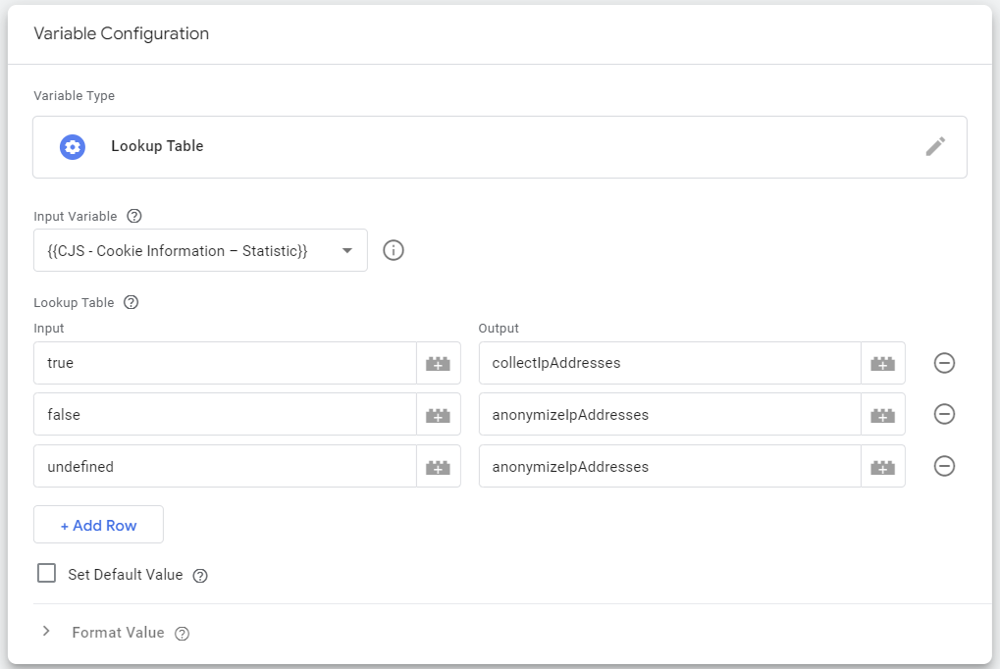
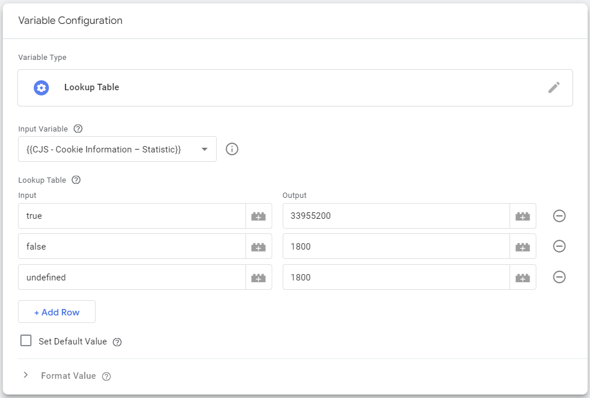

# Piwik PRO Anonymization mode template for Google Tag Manager

This template allows you to map your CMP's state to Piwik PRO Anonymous tracking modes.

Make sure you have already installed the Piwik PRO Analytics template.

- [Configuring the Piwik PRO Analytics template](analyticstemplate)
- [Configuring the deanonymization/re-anonymization events](events)
- [Template configuration for different consent management platforms](platforms)
  - [Cookie Information](#cookieinformation)
  - [OneTrust](#onetrust)

## Configuring the Piwik PRO Analytics template <a name="analyticstemplate"></a>

> [!NOTE]
> The session hash feature is controlled by the settings available in the Piwik PRO Administration module.
> To either enable it or disable it for non-anonymous visitors, go to the Administration module, select your site, go to the Privacy tab and use the "Use a session hash" toggle.
> The same toggle is available for anonymous visitors and can be found in the Consent settings section.

1. In the `Basic tracking code` tag enter the `Privacy` section
2. The `IP collection mode` field should be controlled by a variable, preferably a Lookup Table that will match your CMP consent state to the collection mode.
   Here's an example of how you can use this with the Cookie Information CMP platform.

   

3. If you want to use the 30-minute visitor cookie for anonymous visitors, leave the `Use visitor cookies` field set to true. If you are using the cookieless mode (session hash) make sure to create a variable that will be set to either `false` or `true` depending on the CMP consent state (similarly to what's been done in step 2).
4. When 30-minute visitor cookie is being used, the `Remove the visitor cookie at custom time` field should be set up similiary to step 2. `33955200` for non-anonymous visitors (13 months) and `1800` for anonymous visitors (30 minutes).

   

## Configuring the deanonymization/re-anonymization events <a name="events"></a>

1. Add the template to your Google Tag Manager container
2. Add a trigger to the tag. Different CMPs generate different events for the consent change event. The next section shows you an example of how you can set this up with Cookie Information.
3. Select one of the options in `Select which event should be handled`
4. Select one of the options in `Select which data collection mode is used for anonymous visitors`
5. (optional) Adjust additional settings

## Template configuration for different consent management platforms <a name="platforms"></a>

- [Cookie Information](#cookieinformation)
- [OneTrust](#onetrust)

### Cookie Information <a name="cookieinformation"></a>

1. Create a `Custom HTML` tag and add the code below. This will generate a dataLayer event called `statistic_consent_change` when the visitor interacts with your consent form.

   ```html
   <script>
     window.addEventListener(
       "CookieInformationConsentSubmitted",
       function (event) {
         window.dataLayer = window.dataLayer || [];
         dataLayer.push({
           event: "consent_change",
         });
       }
     );
   </script>
   ```

2. Make sure the tag is triggered on all pages, after the Cookie Information CMP is added to the website/application.
3. Create a `Custom JavaScript` variable and add the code below.

   ```javascript
   function() {
    return window.CookieInformation.getConsentGivenFor('cookie_cat_statistic');
   }
   ```

   **Note:** This variable can be also used in the `Configuring the Piwik PRO Analytics template` guide as a source of truth for the consent state.

4. For the deanonymization tag, go back to the `Piwik PRO Anonymization` tag and add a `Custom Event` trigger to it. Set the `Event name` to `consent_change` and add a condition that will make the tag fire only if the variable above is set to `true`.
5. For the reanonymization tag, perform the same steps but use `false` for the condition instead.

### OneTrust <a name="onetrust"></a>

1. Create a `Custom HTML` tag and add the code below. This will generate a dataLayer event called `consent_change` when the visitor interacts with your consent form.

   ```html
   <script>
     window.OneTrust.OnConsentChanged(function (event) {
       window.dataLayer = window.dataLayer || [];
       dataLayer.push({
         event: "consent_change",
       });
     });
   </script>
   ```

2. Make sure the tag is triggered on all pages, after the OneTrust CMP is added to the website/application.
3. Create or use a variable that will return the current state of the OT consent groups. You can use [this template](https://github.com/taneli-salonen1/gtm-onetrust-consent-groups) created by Taneli Salonen. The other options I know about:

   - Reading the `OneTrustGroupsUpdated` dataLayer event
   - Reading the `OptanonConsent` cookie and looking for `groups` variable

4. For the deanonymization tag, go back to the `Piwik PRO Anonymization` tag and add a `Custom Event` trigger to it. Set the `Event Name` to `consent_change` and add a condition that will only fire the tag if the above variable contains the desired consent group (e.g. `C0002`).
5. For the reanonymization tag, perform the same steps but use the "doesn't contain" condition instead.
